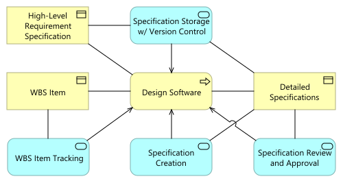

% Almirah Framework Architecture

# Overview

This document defines the architecture of the Almirah framework as a set of processes (work instructions) and software components used for:

* Project Management
* Requirements Management
* Test Management
* Change Management

# Reference Documents

| Document ID | Document Title                         |
|---|---|
| SYS | [Almirah System Specification](sys.md) |

# Business Process View

Almirah framework is designed to support software development process that is a composition of the following high-level processes:

* Software release planning;
* Software design;
* Software implementation;
* Software testing;
* Final software release process.

The Software Testing process can be split into two stages:

* Test Design Process, where Test Cases are created against specifications;
* Test Execution Process, where preliminary created Test Cases are executed on the Software Implementation artifact.

## Software Release Planning

On the release planning stage a High-Level Requirements (an a process input) are transformed to the Work Breakdown Structure (process output).

The Work Breakdown Structure elements (WBS Items) are used to track planned activities through all the processes.

The transformation of High-Level Requirements to the Work Breakdown Structure requires the following software services:

* High-Level Requirements to be captured in a form of specification and stored with version control;
* WBS Items to be created with appropriate planning  attributes, such as: effort estimation, start date, end date, item type, sub-items.

## Software Design

Software design process transforms High-Level Requirement Specification stored with version control to one or several Detailed Specification(s).

Several examples of Detailed Specification are:

* Software Requirements Specification;
* Functional Requirements Specification;
* Non-functional Requirements Specification;
* Software Architecture Specification;
* System Architecture Specification;
* Software Detailed Design Specification;
* e.t.c.

WBS Item(s) is(are) used to track the scope of transformation High-Level Requirements to Detailed Specifications. A WBS Item Tracking software service is required to instrument this process.

For example, WBS Item can cover the transformation of entire specification, one or several sections, or even a single High-Level Requirement paragraph.

All the Detailed Specifications need to be:

* Created;
* Stored with version control;
* Reviewed and approved;

with dedicated software services.

### Traceability

Almirah framework defines several traceability types for the Software Design Process:

* Specification to WBS Item (S2WI) traceability;
* WBS Item to Specification (WI2S) traceability;
* Specification to Specification (S2S) traceability;

Sections below describe the purpose of each traceability type in the Software Design Process.

#### S2WI Traceability

Specification to WBS Item traceability is used to identify the scope of WBS Item. It can be applied to the High-Level Requirement Specification transformation to a Detailed Specification.

Or S2WI traceability can be applied to the transformation of one Detailed Specification to another.

S2WI Traceability creation and maintenance requires the S2WI Traceability Management software service that is a composition of:

* S2WI Traceability Creation service;
* S2WI Traceability Review service;
* S2WI Traceability Approval service.

#### WI2S Traceability

WBS Item to Specification traceability is used to identify exact output of Software Design process obtained in scope of WBS Item. It can be applied to both: the High-Level Requirement Specification transformation to a Detailed Specification, and Detailed Specification to Detailed Specification transformations.

WI2S Traceability creation and maintenance requires the WI2S Traceability Management software service that is a composition of:

* WI2S Traceability Creation service;
* WI2S Traceability Review service;
* WI2S Traceability Approval service.

#### S2S Traceability

Specification to Specification traceability is used:

* To identify the logical connection between two specifications;
* To show how the high-level specification item was designed on the low-level;
* To verify the completeness of the Software Design Process.

S2S Traceability is applied to both: the High-Level Requirement Specification transformation to a Detailed Specification, and Detailed Specification to Detailed Specification transformations.

S2S Traceability creation and maintenance requires the S2S Traceability Management software service that is a composition of:

* S2S Traceability Creation service;
* S2S Traceability Review service;
* S2S Traceability Approval service.

## Software Implementation

Software Implementation process transforms Detailed Specifications stored with version control to the Source Code. The Source Code is created, stored with version control, reviewed and approved during the Software Implementation process.

WBS Item(s) is(are) used to track the scope of transformation Detailed Specifications to the Source Code. A WBS Item Tracking software service is required to instrument this process.

For example, WBS Item can cover the transformation of entire specification, one or several sections, or even a single Detailed Specification paragraph.

The Source Code need to be:

* Created;
* Stored with version control;
* Reviewed and approved;

with dedicated software services.

### Traceability

Almirah framework defines several traceability types for the Software Implementation Process:

* Specification to WBS Item (S2WI) traceability;
* WBS Item to Code (WI2C) traceability;

Sections below describe the purpose of each traceability type in the Software Implementation Process.

#### S2WI Traceability

Specification to WBS Item traceability is used to identify the scope of WBS Item that will be used further for the transformation of a Detailed Specification to the Source Code.

S2WI Traceability creation and maintenance in scope of Software Implementation Process requires the same S2WI Traceability Management software services used for S2WI Traceability creation and maintenance in Software Design Process. These services are the following:

* S2WI Traceability Creation service;
* S2WI Traceability Review service;
* S2WI Traceability Approval service.

#### WI2C Traceability

WBS Item to Code traceability is used to identify the exact output of the Software Implementation process obtained in the scope of WBS Item.

WI2C Traceability creation and maintenance requires the WI2C Traceability Management software service that is a composition of:

* WI2C Traceability Creation service;
* WI2C Traceability Review service;
* WI2C Traceability Approval service.

## Software Testing

### Test Design Process

The Software Testing process transforms Detailed Specifications stored with version control to the Test Cases in the (Test Design stage).

WBS Item(s) is(are) used to track the scope of transformation Detailed Specifications to the Test Cases. A WBS Item Tracking software service is required to instrument this process.

WBS Item can cover a single or multiple specification transformation to a Test Case, one or several sections, or even a single Detailed Specification paragraph.

The Test Cases need to be:

* Created;
* Stored with version control;
* Reviewed and approved;

with dedicated software services.

### Test Execution Process

When any software artifact is ready for testing (Test Execution stage), these Test Cases are executed to verify that the software artifact implementation meets Detailed Specifications.

WBS Item(s) is(are) used to track the scope of Test Case Execution. A WBS Item Tracking software service is required to instrument this process. WBS Item can include a single or multiple Test Cases for execution.

With dedicated software services, preliminary created, stored, reviewed, and approved Test Cases need to be:

* Marked with pass/fail results;
* Stored with version control with these marks;
* Reviewed and approved;

### Traceability

Almirah framework defines several traceability types for the Software Testing Processes:

* Specification to WBS Item (S2WI) traceability;
* WBS Item to Test Cases (WI2T) traceability;
* Specification to Test Case (S2T) Traceability.

Sections below describe the purpose of each traceability type in the Software Testing Processes.

#### S2WI Traceability

In the Test Design Process, the Specification to WBS Item traceability is used to identify the scope of the WBS Item that will be used further to transform a Detailed Specification into Test Cases.

In the Test Execution Process, the Specification to WBS Item traceability defines the scope of Test Cases for testing particular Detailed Specification items.

S2WI Traceability creation and maintenance require the same S2WI Traceability Management software services in both processes. These services are the following:

* S2WI Traceability Creation service;
* S2WI Traceability Review service;
* S2WI Traceability Approval service.

#### WI2T Traceability

WBS Item to Test Case traceability is used to identify the exact list of Test Cases either designed or executed in the scope of this WBS Item.

WI2T Traceability creation and maintenance requires the WI2T Traceability Management software service that is a composition of:

* WI2T Traceability Creation service;
* WI2T Traceability Review service;
* WI2T Traceability Approval service.

#### S2T Traceability

Specification to Test Case traceability defines what specification part (section or paragraph) is covered (tested) with the particular test. This type of traceability is applicable for both: Test Design and Test Execution Processes.

S2T Traceability creation and maintenance requires the S2T Traceability Management software service that is a composition of:

* S2T Traceability Creation service;
* S2T Traceability Review service;
* S2T Traceability Approval service.

## Software Release Closure

On the software release closure stage all the planned artifacts are released. The list of artifacts may include:

* Software Source Code;
* Software Binaries;
* Detailed Specifications;
* Test Cases (either executed or not).

Exact list of the required artifacts depends on the project type and is defined on the Release Planning stage.

Releasing artifacts requires the following software services at the minimum:

* Source Code Storage w/ Version Control;
* Specification Storage w/ Version Control;
* Test Case Storage w/ Version Control;
* Specification Export;
* Test Case Export.

The list of WBS Item types required to plan and close release process is the following:

* Source Code Release;
* Software Binary Release;
* Specification Release;
* Test Cases Release.

# Application View

The complete list of software services identified to service all the Software Release Development Processes is the following:

1. S2S Traceability Management;
   * S2S Traceability Creation;
   * S2S Traceability Review;
   * S2S Traceability Approval;
1. S2T Traceability Management;
   * S2T Traceability Creation;
   * S2T Traceability Review;
   * S2WI Traceability Approval;
1. S2WI Traceability Management
   * S2WI Traceability Creation;
   * S2WI Traceability Review;
   * S2WI Traceability Approval;
1. Source Code Creation
1. Source Code Storage w/ Version Control
1. Source Code  Review and Approval
1. Specification Creation;
1. Specification Storage w/ Version Control;
1. Specification Review and Approval;
1. Test Case Creation;
1. Test Case Storage w/ Version Control;
1. Test Case Review and Approval;
1. Test Marking;
1. WBS Item Creation;
1. WBS Item Tracking;
1. WI2C Traceability Management
   * WI2C Traceability Creation;
   * WI2C Traceability Review;
   * WI2C Traceability Approval;
1. WI2S Traceability Management
   * WI2S Traceability Creation;
   * WI2S Traceability Review;
   * WI2S Traceability Approval;
1. WI2T Traceability Management
   * WI2T Traceability Creation;
   * WI2T Traceability Review;
   * WI2T Traceability Approval;
1. Specification Export;
1. Test Case Export.

## WBS Software Services

The WBS Item Creation and WBS Item Tracking services are realized by the Task/Issue Tracking Software.

Since there are different processes to be tracked with WBS Items (Software Design, Software Implementation, Test Design, Test Execution) the Task/Issue Tracking Software shall support the following item types:

* Document Task;
* Code Task;
* Test Design Task;
* Test Execution Task.

## Content Creation Services

Almirah framework defines markdown files as the primary format for creating Detailed Specifications and Test Cases. The Test Marking is defined as a Test Case update process in markdown format, which inserts pass/fail marks into the file.

A Markdown Files Editor realizes the following software services:

* Specification Creation service;
* Test Case Creation service;
* Test Marking service.

The Source Code Creation is realized by a Source Code Editor. The Source Code Editor and Markdown Files Editor can be the same Integrated Development Environment if it supports both formats.

## Storage with Version Control

Since Specifications and Test Cases are created as markdown files, it is possible to store them in a Source Control in the same way as the Source Code.

It is recommended to maintain separate repositories for:

1. Source Code;
2. Specifications (High-Level Requirement Specification and Detailed Specifications) and Test Cases (both executed and not executed).

## Content Review and Approval Services

A Code Review Software is used to review and approve the content of:

* Detailed Specifications;
* Source Code;
* Test Cases;
* Executed Test Cases.

The Source Control may Realize these content review services as well.

## Traceability Services

### S2S Traceability

In Almirah framework traceability between specifications is implemented with a custom extension to the markdown syntax.

This extension consists of two tags:

* Paragraph ID tag - "[SPID-001]" placed at the start of the paragraph, where
  * SPID - is a current specification ID letters;
  * 001 - is a unique paragraph number in this specification (can be non-sequential);
* Reference to paragraph ID tag - ">[SPID-001]" placed at the end of the paragraph that refers to a paragraph in another specification;
  * SPID - is another(external) specification ID letter;
  * 001 - is a unique paragraph number in the external specification;

These Markdown extensions are added manually to the specification body with the Markdown Files Editor and processed by a custom Ruby script (Almirah Ruby gem). The processing includes:

1. Parsing all the specifications;
1. Identification of S2S links;
1. S2S link errors check:
   * against duplicated paragraph ID tags;
   * against links to non-existing paragraph ID tag; 
1. Rendering all the specifications to HTML files where the S2S links are replaced with hyperlinks.

Specifications converted to HTML with hyperlinks allows to review S2S links for correctness.

When S2S links are reviewed for correctness with Code Review Software in raw and HTML format, specifications containing these links are approved in the Code Review Software.

### S2T Traceability

In Almirah framework traceability between Specifications and Test Cases is implemented with custom extension to the markdown syntax and several additional rules.

These rules are the following:

* Test Case markdown file name defines the Test Case ID;
* Test Case markdown file name consists of two parts combined with dash ("tc-001"):
  * several letters as a prefix (for example "tc");
  * sequential number of the test case (for example "001");
* Test Case steps are defined as rows in the markdown table, where:
  * The first column indicates the test step number (1, 2, 3, e.t.c);
  * The last column is reserved for the reference to a specification paragraph ID (reference to paragraph ID tag - ">[SPID-001]") if the step is intended to verify some statement from the specification (see [S2S Traceability](#s2s-traceability-1) section for details);
  * The column before the last is reserved for the test step result. The only "pass" and "fail" marks are defined for this purpose. All other values are ignored.

These Markdown extensions are added manually to the test case body with the Markdown Files Editor and processed by a custom Ruby script (Almirah Ruby gem). The processing includes:

1. Parsing all the specifications;
1. Parsing all the test cases;
1. Identification of S2T links;
1. S2T link errors check:
   * against duplicated test steps;
   * against links to non-existing paragraph ID tag;
1. Rendering all the specifications to HTML files where the S2T links are replaced with hyperlinks;
1. Rendering all the test cases to HTML files where the S2T links are replaced with hyperlinks;

Specifications and Test Cases converted to HTML with hyperlinks in both directions allow the review of S2T links for correctness.

When S2T links are reviewed for correctness with Code Review Software in raw and HTML format, test cases containing these links are approved in the Code Review Software.

### S2WI Traceability

As it was stated in the [Business View](#s2wi-traceability) section, the Specification to WBS Item traceability is used to define the scope of the transformation of either:

* High-Level Requirements Specification to Detailed Specification;
* Or Detailed Specification to Detailed Specification.

The Task/Issue Tracking Software ultimately realizes this type of traceability.

If a WBS Item requires traceability to specification, it is done by mentioning the specification ID or specification paragraph ID in the Description field of the WBS Item.

S2WI Traceability Review and Approval services are realized via custom WBS Item State field values:

1. When WBS Item is created it has the Draft state;
2. After the scope description in the WBS Item, the author moves the item to the "Scope Review" state;
3. If the reviewer is OK with the scope defined (including specified paragraph IDs), they move the item to the "Scope Approved" state;
4. In the case scope requires correction, the reviewer will move the item back to the Draft state;

### WI2S Traceability

WBS Item to Specification traceability is used to identify exact output of Software Design process. It can be applied to both: the High-Level Requirement Specification transformation to a Detailed Specification, and Detailed Specification to Detailed Specification transformations.

Two software components realize the WI2S Traceability creation part:

* by Source Control with the reference of WBS Item in the Source Control commit message (forward direction);
* by Task/Issue Tracking Software referencing Source Control commit ID in the WBS Item (opposite direction).

WI2S Traceability Review and Approval services are realized by:

* Task/Issue Tracking software with a custom value of the WBS Item State field ("WI2S Traceability Review");
* Code Review Software by a Source Control commit message review.

The "WI2S Traceability Review" stage of the design process can precede the main "Content Review" stage or even both "S2S Traceability Review" and "Content Review" if the S2S traceability review is separated from the content review.

* When one specification (part or item) is transformed into another, the Author moves the WBS Item to the "WI2S Traceability Review" state **(1)**.
* If Reviewer is OK with provided WI2S Traceability they moves WBS Item to "S2S Traceability Review State" **(2)**. Otherwise, Reviewer moves WBS Item to the "Correction Required" state **(5)**.
* In the "S2S Traceability Review" state Reviewer checks if the links between specifications are correct and moves the WBS Item to the "Content Review" sate **(3)** or "Correction Required" state **(6)**.
* If Reviewer is OK with the provided content they moves WBS Item to the "Content Approved" state **(4)**. Otherwise, "Correction Required" state is used **(8)**.
* From the "Correction Required" state the WBS Item is moved back to the Transformation state to implement the corrections **(8)**

The framework divides review process in three stages ("WI2S Traceability Review", "S2S Traceability Review", and "Content Review") to keep focus on a single aspect of the process output on each stage. It also allows dedicated person assignment for each review stage (different reviewers).

### WI2C Traceability

WBS Item to Code traceability is used to identify the exact output of the Software Implementation process.

Two software components realize the WI2C Traceability creation part:

* by Source Control with the reference of WBS Item in the Source Control commit message (forward direction);
* by Task/Issue Tracking Software referencing Source Control commit ID in the WBS Item (opposite direction).

WI2C Traceability Review and Approval services are realized by:

* Task/Issue Tracking software with a custom value of the WBS Item State field ("WI2C Traceability Review");
* Code Review Software by a Source Control commit message review.

The "WI2C Traceability Review" stage of Software Implementation process can precede the main "Content Review" stage.

* When a Specification (part or item) or WBS Item Description is transformed into the Code, Developer moves the WBS Item to the "WI2C Traceability Review" state **(1)**.
* If Reviewer is OK with provided WI2C Traceability they moves WBS Item to the "Content Review" sate **(2)** or "Correction Required" state **(4)** otherwise.
* If Reviewer is OK with the provided content they moves WBS Item to the "Content Approved" state **(3)**. Otherwise, "Correction Required" state is used **(5)**.
* From the "Correction Required" state the WBS Item is moved back to the Transformation state to implement the corrections **(6)**

The framework divides review process in two stages ("WI2C Traceability Review", and "Content Review") to keep focus on a single aspect of the process output on each stage. It also allows dedicated person assignment for each review stage (different reviewers).

### WI2T Traceability

WBS Item to Test Case traceability is used to identify the exact list of Test Cases either designed or executed in the scope of this WBS Item.

Two software components realize the WI2T Traceability creation part:

* by Source Control with the reference of WBS Item in the Source Control commit message (forward direction);
* by Task/Issue Tracking Software referencing Source Control commit ID in the WBS Item (opposite direction).

WI2T Traceability Review and Approval services are realized by:

* Task/Issue Tracking software with a custom value of the WBS Item State field ("WI2T Traceability Review");
* Code Review Software by a Source Control commit message review.

The "WI2T Traceability Review" stage of the Test Design or Test Execution processes can precede the main "Content Review" stage or even both "S2T Traceability Review" and "Content Review" states if the Specification to Taste Case review process is separated from the content review.

* When a Test Case is designed or executed for the Specification (part or a single item), the Tester moves the WBS Item to the "WI2T Traceability Review" state **(1)**.
* If Reviewer is OK with provided WI2T Traceability they moves WBS Item to "S2T Traceability Review State" **(2)**. Otherwise, Reviewer moves WBS Item to the "Correction Required" state **(5)**.
* In the "S2T Traceability Review" state Reviewer checks if the links between specification and test case are correct and moves the WBS Item to the "Content Review" sate **(3)** or "Correction Required" state **(6)**.
* If Reviewer is OK with the provided content they moves WBS Item to the "Content Approved" state **(4)**. Otherwise, "Correction Required" state is used **(8)**.
* From the "Correction Required" state the WBS Item is moved back to the Transformation state to implement the corrections **(8)**

The framework divides review process in three stages ("WI2T Traceability Review", "S2T Traceability Review", and "Content Review") to keep focus on a single aspect of the process output on each stage. It also allows dedicated person assignment for each review stage (different reviewers).

## Export Software Services

The Software Release Closure process requires Specification and Test Cases export software services.

Specifications and/or Test Cases (either executed or not) are loaded from the Source Control using a release tag, label, or commit ID in the form of Markdown files. Then, these files are converted to the defined output format with Markdown Files Converter.

Markdown Files Converter saves the content of Specifications and Test Cases in the format of any Text Processor software supports.

Further export steps define:

* Adjust Formatting of the document;
* Review document in the exported format;
* Conversion of document to a PDF document.

All these steps are made with a Text Processor Software.

# Software Component Requirements

Analysis described above allows to come up with the following software components requirements (divided by sections).

## Source Control

[ARCH-001] Source Control Software Component shall store source code files.

[ARCH-002] Source Control Software Component shall store markdown files.

[ARCH-003] Source Control Software Component shall allow to specify a commit message.

[ARCH-004] Source Control Software Component shall allow to reference to a particular commit ID or version ID.

## Code Review

[ARCH-005] Code Review Software Component shall allow to review source code files.

[ARCH-006] Code Review Software Component shall allow to review markdown files.

[ARCH-007] Code Review Software Component shall allow to review commit message files.

## Markdown Editor

[ARCH-008] Markdown Editor Software Component shall allow to create markdown files.

[ARCH-009] Markdown Editor Software Component shall allow to edit markdown files.

## Source Code Editor

[ARCH-010] Source Code Editor Software Component shall allow to create source code files.

[ARCH-011] Source Code Editor Software Component shall allow to edit source code files.

## Markdown Files Converter

[ARCH-012] Markdown Files Converter Software Component shall convert markdown files to a Text Processor files format (documents).

## Text Processor

[ARCH-013] Text Processor Software Component shall allow to edit documents in the Text Processor file format.

[ARCH-014] Text Processor Software Component shall allow to adjust formatting of documents.

[ARCH-015] Text Processor Software Component shall allow to export documents to PDF format.

## Task/Issue Tracking Software

[ARCH-016] Task/Issue Tracking Software Component shall allow to create different WBS Item types.

[ARCH-017] Task/Issue Tracking Software Component shall allow to create a custom WBS Item states for each item type.

[ARCH-018] Task/Issue Tracking Software Component shall allow to create a custom workflow for each WBS Item type.

[ARCH-019] Task/Issue Tracking Software Component shall allow to write a description for each WBS Item.

## Almirah Ruby gem

[ARCH-020] Almirah Ruby gem shall convert specifications from markdown format to HTML format.

[ARCH-021] Almirah Ruby gem shall convert test cases from markdown format to HTML format.

[ARCH-022] Almirah Ruby gem shall support **Paragraph ID** tag  as a markdown extension.

**Paragraph ID** tag is "[SPID-001]" placed at the start of the paragraph, where

* SPID - is a current specification ID letters (capitalized);
* 001 - is a unique paragraph number in this specification (can be non-sequential).

[ARCH-023] Almirah Ruby gem shall support **Reference to Paragraph ID** tag as a markdown extension.

**Reference to paragraph ID** tag is ">[SPID-001]" placed at the end of the paragraph that refers to a paragraph in another specification, where

* SPID - is another(external) specification ID letter (capitalized);
* 001 - is a unique paragraph number in the external specification.

[ARCH-024] Almirah Ruby gem shall replace **Paragraph ID** and **Reference to Paragraph ID** tags with hyperlinks between specifications in HTML format.

[ARCH-025] Almirah Ruby gem shall support **Test Step** tags as a markdown extension.

**Test Steps** are defined as rows in the markdown table, where:

* The first column indicates the **Test Step Number** (1, 2, 3, e.t.c);
* The last column is reserved for the reference to a specification paragraph ID (**Reference to Paragraph ID** tag - ">[SPID-001]") if the step is intended to verify some statement from the specification;
* The column before the last is reserved for the **Test Step Result**. The only "pass" and "fail" marks are defined for this purpose. All other values are ignored.

[ARCH-026] Almirah Ruby gem shall process test case markdown file name as a **Test Case ID**.

Test case markdown file name (**Test Case ID**) consists of two parts combined with dash ("tc-001"):

* Several letters as a prefix (for example "tc");
* Sequential number of the test case (for example "001", "002", e.t.c.).

[ARCH-027] Almirah Ruby gem shall process specification markdown file name as a **Specification ID**.

**Specification ID** is several letters in lower case, that will be used as a **Paragraph ID** prefix converted to capital letters (for example, "spid.md", "arch.md", "srs.md" e.t.c).

[ARCH-028] Almirah Ruby gem shall replace **Test Step Number** and **Reference to Paragraph ID** tags with hyperlinks between specification and test cases in HTML format.

[ARCH-029] Almirah Ruby gem shall generate one-to-one traceability matrices for specifications.

One-to-one traceability matrix indicates references from one specification to another.

[ARCH-030] Almirah Ruby gem shall generate one-to-all traceability matrices for specifications.

One-to-all traceability matrix indicates references from all specifications to a single one.

[ARCH-031] Almirah Ruby gem shall generate one-to-all traceability matrices for specification and test cases.

One-to-all traceability matrix indicates references from all test cases to one specification.
