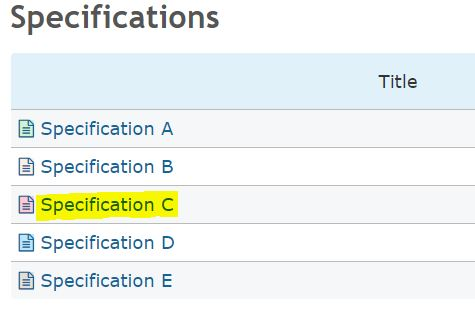
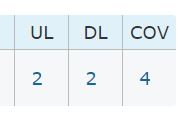
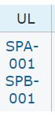
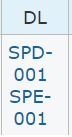
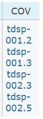
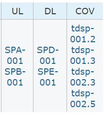

# Test Case TP-002

## Test Summary

| Parameter | Value |
|---|---|
| Software Version | |
| OS Version | |
| Test Result| |
| Test Date| |
| Tester Name | |
| Tester Signature | |

## Preconditions

1. Ruby is installed
2. Almirah gem is installed
3. Get is installed

## Test Procedure

| Test Step | Test Step Description | Expected Output | Actual Output | Result | Req-ID |
|---|---|---|---|---|---|
| 1 | Clone [Testing Data Set](https://github.com/OleksandrIvanovDev/Almirah.TDS.git) repository  | n/a | n/a | n/a | n/a |

Feel free to use the following option:

```bash
git clone https://github.com/OleksandrIvanovDev/Almirah.TDS.git
```

| Test Step | Test Step Description | Expected Output | Actual Output | Result | Req-ID |
|---|---|---|---|---|---|
| 2 | Navigate to Almirah.TDS folder  | n/a | n/a | n/a | n/a |
| 3 | Switch to branch tp-002  | n/a | n/a | n/a | n/a |

Feel free to use the following option:

```bash
git checkout tp-002
```

| Test Step | Test Step Description | Expected Output | Actual Output | Result | Req-ID |
|---|---|---|---|---|---|
| 4 | Run Almirah gem in the current folder  | n/a | n/a | n/a | n/a |

Feel free to use the following option:

```bash
Almirah please ./
```

| Test Step | Test Step Description | Expected Output | Actual Output | Result | Req-ID |
|---|---|---|---|---|---|
| 5 | Navigate to the build folder  | n/a | n/a | n/a | n/a |
| 6 | Open index.html file in the Internet Browser  | n/a | n/a | n/a | n/a |
| 7 | Link to the "Specification C" (see below)  | n/a | n/a | n/a | n/a |



| Test Step | Test Step Description | Expected Output | Actual Output | Result | Req-ID |
|---|---|---|---|---|---|
| 8 | Open index.html file in the Internet Browser  | n/a | n/a | n/a | n/a |
| 9 | Link to the "Specification C" (see below)  | n/a | n/a | n/a | n/a |
| 10 | Check that SPC-001 item has: 2 up-links, 2 down-links, and 4 coverage links | see below  | | | >[SRS-031], >[SRS-033], >[SRS-035] |

**Expected output:**



| Test Step | Test Step Description | Expected Output | Actual Output | Result | Req-ID |
|---|---|---|---|---|---|
| 11 | Click to the up-link number  | n/a | n/a | n/a | n/a |
| 12 | Check that two links "SPA-001" and "SPB-001" are indicated in the "UL" column  | see below | | | >[SRS-031] |

**Expected output:**



| Test Step | Test Step Description | Expected Output | Actual Output | Result | Req-ID |
|---|---|---|---|---|---|
| 13 | Click to the down-link number  | n/a | n/a | n/a | n/a |
| 14 | Check that two links "SPD-001" and "SPE-001" are indicated in the "DL" column  | see below | | | >[SRS-033] |

**Expected output:**



| Test Step | Test Step Description | Expected Output | Actual Output | Result | Req-ID |
|---|---|---|---|---|---|
| 15 | Click to the coverage link number  | n/a | n/a | n/a | n/a |
| 16 | Check that four links "tdsp-001.2", "tdsp-001.3", "tdsp-002.3", and "tdsp-002.5" are indicated in the "COV" column  | see below | | | >[SRS-035] |

**Expected output:**



| Test Step | Test Step Description | Expected Output | Actual Output | Result | Req-ID |
|---|---|---|---|---|---|
| 17 | Check that all the "UL", "DL", "COV" columns indicates the exact IDs instead of number of links  | see below | | | >[SRS-031], >[SRS-033], >[SRS-035] |

**Expected output:**

